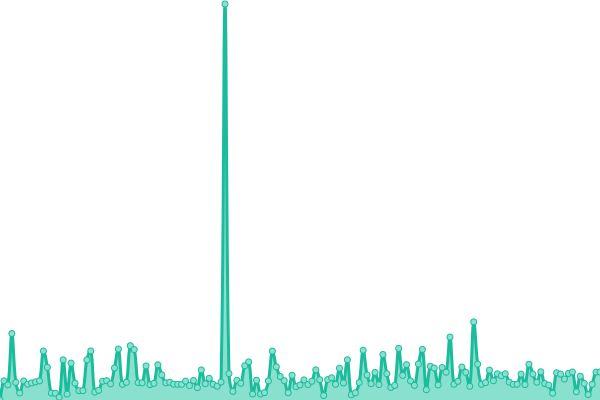
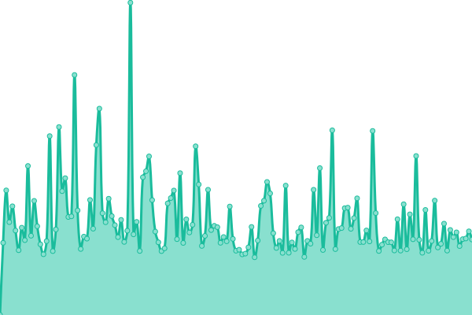

# [📈 Live Status](https://vrxyt.github.io/status-l3st): <!--live status--> **🟧 Partial outage**

This repository contains the open-source uptime monitor and status page for [VRX](L3ST.PL), powered by [Upptime](https://github.com/upptime/upptime).

With [Upptime](https://upptime.js.org), you can get your own unlimited and free uptime monitor and status page, powered entirely by a GitHub repository. We use [Issues](https://github.com/vrxyt/status-l3st/issues) as incident reports, [Actions](https://github.com/vrxyt/status-l3st/actions) as uptime monitors, and [Pages](https://vrxyt.github.io/status-l3st) for the status page.

<!--start: status pages-->
<!-- This summary is generated by Upptime (https://github.com/upptime/upptime) -->
<!-- Do not edit this manually, your changes will be overwritten -->
<!-- prettier-ignore -->
| URL | Status | History | Response Time | Uptime |
| --- | ------ | ------- | ------------- | ------ |
|  [L3ST](https://l3st.pl) | Aktywny | [l3-st.yml](https://github.com/vrxyt/status-l3st/commits/HEAD/history/l3-st.yml) | 

 212ms
     
 | 

<a href="https://status.l3st.pl/history/l3-st">100.00%</a>
    

|  [Panel L3ST](https://panel.l3st.pl) | Aktywny | [panel-l3-st.yml](https://github.com/vrxyt/status-l3st/commits/HEAD/history/panel-l3-st.yml) | 

 605ms
     
 | 

<a href="https://status.l3st.pl/history/panel-l3-st">100.00%</a>
    

|  [S1.L3ST.PL](188.64.33.30) | Aktywny | [s1-l3-st-pl.yml](https://github.com/vrxyt/status-l3st/commits/HEAD/history/s1-l3-st-pl.yml) | 

 109ms
     
 | 

<a href="https://status.l3st.pl/history/s1-l3-st-pl">100.00%</a>
    

|  [Mail L3ST](https://mail.l3st.pl) | Aktywny | [mail-l3-st.yml](https://github.com/vrxyt/status-l3st/commits/HEAD/history/mail-l3-st.yml) | 

 687ms
     
 | 

<a href="https://status.l3st.pl/history/mail-l3-st">100.00%</a>
    

|  [Test powiadomień discord](https://thissitedoesnotexist.koj.co) | Offline | [test-powiadomien-discord.yml](https://github.com/vrxyt/status-l3st/commits/HEAD/history/test-powiadomien-discord.yml) | 

 0ms
     
 | 

<a href="https://status.l3st.pl/history/test-powiadomien-discord">7.29%</a>
    

<!--end: status pages-->

[**Visit our status website →**](https://vrxyt.github.io/status-l3st)

## 📄 License

- Powered by: [Upptime](https://github.com/upptime/upptime)
- Code: [MIT](./LICENSE) © [Anand Chowdhary](https://anandchowdhary.com), supported by [Pabio](https://pabio.com)
- Data in the `./history` directory: [Open Database License](https://opendatacommons.org/licenses/odbl/1-0/)
